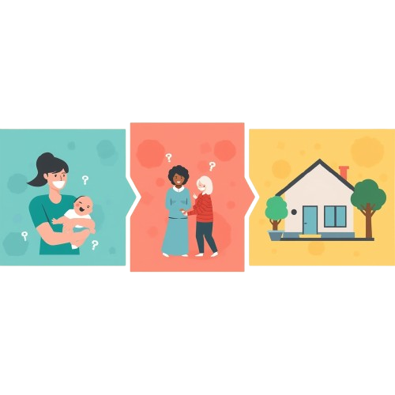

# CareConnect - Baby Sitting & Elderly Care Service Platform



CareConnect is a comprehensive web application that provides reliable and trusted care services for children, elderly, and other family members. The platform connects users with professional caretakers for babysitting, elderly care, and special home care services.

## 🌟 Live Demo

- **Live Site**: [Your Live Deployment URL]
- **GitHub Repository**: [Your Repo URL]

## 📋 Project Overview

CareConnect (Care.IO) is designed to make caregiving easy, secure, and accessible for everyone. Users can easily find, book, and manage care services through our intuitive platform.

### Key Objectives

- Provide trusted and reliable care services
- Simplify the booking process with duration and location-based selection
- Ensure secure user authentication and data management
- Offer transparent pricing with automatic cost calculation
- Enable easy tracking of booking status and history

## ✨ Features

### Core Features

- ✅ **Responsive Design**: Fully optimized for mobile, tablet, and desktop devices
- 🔐 **User Authentication**:
  - Email & Password login
  - Google Social Login
  - Secure registration with NID verification
- 📅 **Dynamic Booking System**:
  - Select duration (days/hours)
  - Location selection (Division, District, City, Area)
  - Custom address input
  - Real-time total cost calculation
- 📊 **Booking Management**:
  - Track booking status (Pending/Confirmed/Completed/Cancelled)
  - View detailed booking history
  - Cancel bookings when needed
- 🏥 **Multiple Service Categories**:
  - Baby Care Services
  - Elderly Care Services
  - Sick People Care Services
- 📧 **Email Notifications**: Automated invoice emails upon booking

### Additional Features

- 🎨 SEO-optimized with proper metadata
- 🔍 Detailed service information pages
- 💬 Customer testimonials and success metrics
- ⚡ Fast and secure data handling
- 🎯 User-friendly interface with intuitive navigation

## 🛠️ Tech Stack

### Framework

- **Next.js 14+** - React framework for production with App Router
- **React 18** - UI library
- **JavaScript** - Programming language

### Styling

- **Tailwind CSS** - Utility-first CSS framework
- **Daisy ui** (Optional) - Re-usable components

### Authentication

- **NextAuth.js** (Alternative) - Authentication for Next.js

### Database

- **MongoDB** - NoSQL database
- **MongoDB Atlas** - Cloud database service

### API & Backend

- **Next.js API Routes** - Backend API endpoints
- **Server Actions** - Server-side functions
- **Middleware** - Route protection and authentication

### Additional Tools

- **Nodemailer** - Email service
- **React Hook Form** - Form handling
- **React Hot Toast / Sonner** - Notifications
- **Stripe** (Optional) - Payment processing
- **Axios / Fetch API** - HTTP client

## 🚀 Getting Started

### Prerequisites

- Node.js (v18 or higher)
- npm, yarn, or pnpm
- MongoDB database (local or Atlas)
- Git

### Installation

1. **Clone the repository**

```bash
git clone https://github.com/ZilhajSajid/care-next.git
cd care-next
```

2. **Install dependencies**

```bash
npm install
# or
yarn install
# or
pnpm install
```

3. **Environment Variables**

Create a `.env.local` file in the root directory:

```env
# MongoDB
MONGODB_URI=your_mongodb_connection_string

# NextAuth (if using NextAuth instead of Firebase)
NEXTAUTH_URL=http://localhost:3000
NEXTAUTH_SECRET=your_nextauth_secret
GOOGLE_CLIENT_ID=your_google_client_id
GOOGLE_CLIENT_SECRET=your_google_client_secret

# Email Service (Nodemailer)
EMAIL_HOST=smtp.gmail.com
EMAIL_PORT=587
EMAIL_USER=your_email@gmail.com
EMAIL_PASS=your_app_password
EMAIL_FROM=noreply@careconnect.com

# Stripe (Optional)
NEXT_PUBLIC_STRIPE_PUBLISHABLE_KEY=your_stripe_publishable_key
STRIPE_SECRET_KEY=your_stripe_secret_key
STRIPE_WEBHOOK_SECRET=your_webhook_secret

# App Configuration
NEXT_PUBLIC_APP_URL=http://localhost:3000
```

4. **Run the development server**

```bash
npm run dev
# or
yarn dev
# or
pnpm dev
```

Open [http://localhost:3000](http://localhost:3000) in your browser to see the application.

5. **Build for production**

```bash
npm run build
npm start
```

## 📊 Services Overview

### 1. Baby Care Services

Professional babysitting and childcare services for parents who need trusted care for their children.

### 2. Elderly Care Services

Compassionate care for elderly family members including daily assistance, companionship, and health monitoring.

### 3. Sick People Care Services

Specialized home care services for individuals recovering from illness or requiring medical assistance at home.

## 🚀 Deployment

### Vercel (Recommended for Next.js)

1. Push your code to GitHub
2. Import your repository to [Vercel](https://vercel.com)
3. Configure environment variables in Vercel dashboard
4. Deploy automatically

### Alternative Platforms

- **Netlify**: Supports Next.js with serverless functions
- **Railway**: Easy deployment with MongoDB integration
- **AWS/GCP/Azure**: For enterprise-level deployment

### Environment Variables for Production

Make sure to add all environment variables from `.env.local` to your deployment platform.

## 🔒 Authentication Features

- Email and password registration with validation
- Google Social Login integration
- NID number verification for added security
- Password requirements:
  - Minimum 6 characters
  - At least 1 uppercase letter
  - At least 1 lowercase letter
- Persistent login state across page reloads
- Automatic redirect to intended page after login

## 💳 Booking Flow

1. Browse available services
2. Select service and view details
3. Click "Book Service" (redirects to login if not authenticated)
4. Select duration and location
5. Enter detailed address
6. Review total cost (automatically calculated)
7. Confirm booking
8. Receive email invoice
9. Track booking status in "My Bookings"

## 🎯 Challenges Completed

- ✅ Implemented metadata on Home and Service details pages for better SEO
- ✅ Email invoice system upon successful booking
- ⚡ (Optional) Stripe payment integration
- ⚡ (Optional) Admin dashboard with payment histories

## 📝 License

This project is licensed under the MIT License - see the [LICENSE](LICENSE) file for details.

## 👨‍💻 Author

**Your Name**

- GitHub: [@yourusername](https://github.com/ZilhajSajid)
- Email: zilhajsajid@gmail.com

## 🙏 Acknowledgments

- MongoDB for database solutions
- Tailwind CSS for styling framework
- All contributors and testers

## 📞 Support

For support, email zilhajsajid@gmail.com or open an issue in the GitHub repository.

---

**Made with ❤️ for better caregiving services**
